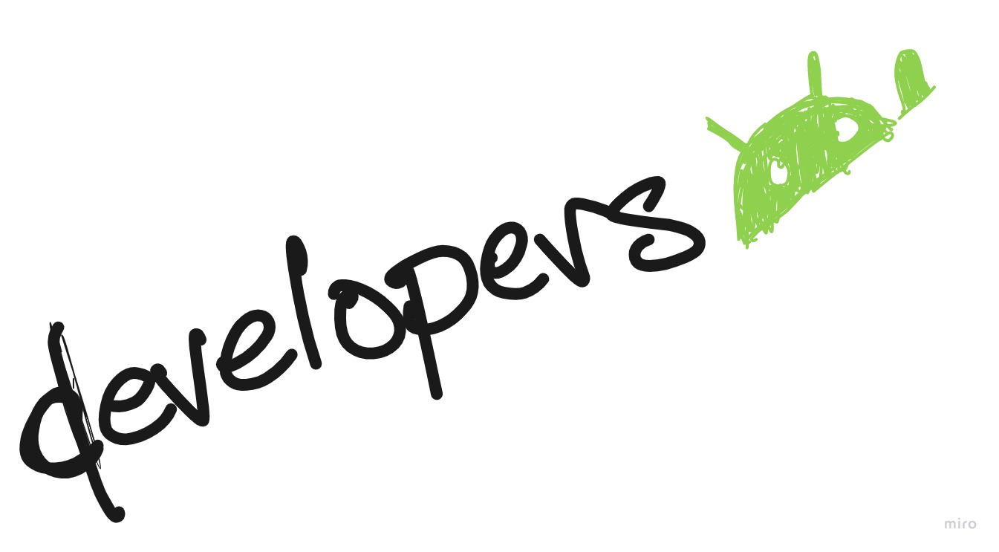
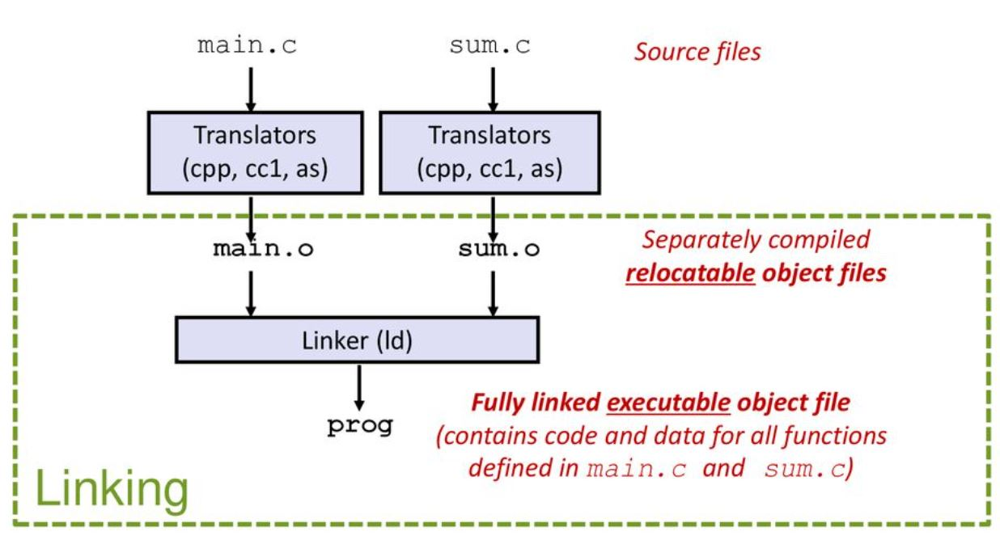
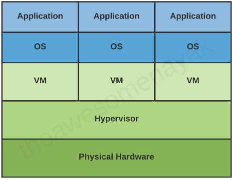
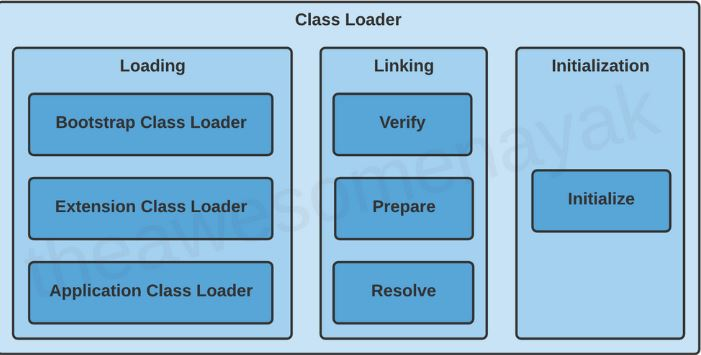

# Reading Notes in Java
- Details below are bullet points for a fullstack class in Java.
## Relational DataBase
- From practicing the Database, I can see that R is similar to SQL Bolt in that grabbing information. The comparison is similar but not the same, but for my understanding, I see the resemblence and can be useful to understand how things are ordered in a database and its limitations from knowing a little bit about R.
- Prep Work For SQL below images:
[img1](public/prepImg/prepsql1.JPG)
[img2](public/prepImg/prepsql2.JPG)
[img3](public/prepImg/prepsql3.JPG)
[img4](public/prepImg/prepsql4.JPG)
[img5](public/prepImg/prepsql5.JPG)
[img6](public/prepImg/prepsql6.JPG)
[img7](public/prepImg/prepsql13.JPG)
[img8](public/prepImg/prepsql14.JPG)
[img9](public/prepImg/prepsql15.JPG)
[img10](public/prepImg/prepsql16.JPG)
[img11](public/prepImg/prepsql17.JPG)
[img12](public/prepImg/prepsql18.JPG)


****
## Reading Notes 1
1. Variables: these are the primitive types such as int, long, double, char, ... Further, there are arrays and Strings we may utilize in Java. 
2. Operators: logical operators (!, ?=, ==,  <,>, <=, >=), instance of are a few of the operators we may use.
3. an Expression is like a sentence in grammer. you must specify keywords and logic to create a sentence. 
4. the Control Flow can change the flow of reading a program by using inheritence , looping, and/or logic 
5. A compiler is a tool that is used to check for errors such as syntax and any throws needed. it also integrates the libraries(dependencies) needed along with unwinding the stack. Machine language kicks off(linux uses ARM/ASM or depends on distro). 

****

****
## Things I want to know about:
****



## Reading Notes: Application Fundamentals (Software Development Kit)
  - SDK is a collection of development tools to develop Android application that is combined in one package that compiles the code along with Android app bundle.
  - Android apps can be written using kotlin, java, and C++. In other words, uses JVM to generate a class file. 
  
  - C++ may remind me of Linker set up, source files (main.cpp) -> translators -> relocatable object files -> linker(libraries and symbols) -> executable. 
  - However, the process of JVM is takes over for Android development. Instead of compiled language format of linking process, the way Java Architecture takes a different approach. this approach is creating virtual machines isolated with their own operating system on without using local machines operating system.   
  
  - here the JVM architecture is not that much more complicated. first java creates a source code (.java) then bytcode as a (.class). in a nutshell thats it!
  - where it gets a bit more sophistacated is in the class loading process.
    - load process allocates the memory using libraries predefined.
    - linking takes care of dependencies, symbols, etc
    - intialization takes static and interfaces and handles them differently as they arent immediately implemented.
    
  - thus, the process is the same for all languages in Android Development apps. whether c++ or kotlin. with the power of JVM one can pull kotlin and convert it to bytecode, then reconvert it to java, or Kotlin! all because JVM handles them all the languages the same way. 

- Android is a operating system - stack based linux kernel(acts as a interface between hardware and software). it is a open source environment. some features are touchscreen and smart phone capabilities. 
- thus security is handled differently from other operating system. the goal is to be flexible to all users and developers. things like connectivity to all lan, bluetooth devices, gyroscopes.
- linux system is in each app which is a different user in each kit
- Virtual machin runs in isolation from other apps (very similar to jvm)

### App components
- four types of app components: 
- Activities:
  - entry point for interacting with the user.such as reading emails, sorting emails, etc for user
- Services: entry point for running app in the background. such as music running continuously and closing app.
- Content Providers: allows sharing of an application data with another application. can be a file or entire SQLite database.
- Broadcast receivers: allows an application to respond to a bradcast intent. broadcast is set to low battery, then the broadcast receiver will run a code that will notify user that it is on low battery for charging. 

### Activating components
- all three (activities, services, and broadcast receivers) are asynchronous  messages called "intent".
- Intent which defines a message  to activate either a specific component or a pecific type of component. 
- it is an object that activates in a activity or service such as display information or send information.
- content providers handle exchanging information differently. they use Content Resolvers.
- startActivity() or startActivityForResult() does the activation in activity
- you can initiate a broadcast by passing intent to methods such as sendBroadcast(), sendorderedbroadcast(), or sendstickybroadcast().


### Manifest
- contains files in which it describes informtation about your application, such as build tools, package name, application metadata, registered activities, intent filters, permissions, and more.

`<?xml version="1.0" encoding="utf-8"?>
<manifest ... >
    <application android:icon="@drawable/app_icon.png" ... >
        <activity android:name="com.example.project.ExampleActivity"
                  android:label="@string/example_label" ... >
        </activity>
        ...
    </application>
</manifest>`

### Android template architecture
- manifest handles infromation about application.
- java folder contains java files which can be things like mainactivity class. this is where the main activities should derive from.
- resource folder contains all useful things for application to use
  - drawable has things like images, gifs, etc
  - layout is the template in which our application will look like (front end kind of thing)
  - values are static variables that we can use.


 ### Shared Preferences API
 - SharedPreferences allows key value pairs to be used from a file. 
 - to store and retrieve, use getSharedPreferences() from a Context. use case if is you are using multiple preference files identified by name. specify with the first parameter.
 - getPreferences() usage for an Activity. to use for one shared preference file of the activity.
 - For example, the following code accesses the shared preferences file that's identified by the resource string R.string.preference_file_key and opens it using the private mode so the file is accessible by only your app:

  ```
  Context context = getActivity();

  SharedPreferences sharedPref = context.getSharedPreferences(getString(R.string.preference_file_key),
  Context.MODE_PRIVATE);

  //use case for an Activity for one preference file
  SharedPreferences sharedPref = getActivity().getPreferences(Context.MODE_PRIVATE);

  ````

- naming convention for shared prefernce files should be done as follows `com.example.myapp.PREFERENCE_FILE_KEY` 

***

## Activity Lifecycle

- Creating lifecycle methods for users to stop and play are useful features to have.
- if used correctly, lifecycles can avoid buggy instances.
  * Crashing when a phone call is made or switches to another app while on current app.
  * Consuming system resources when not using the app
  * losing the users progress if returned later on
  * crash when rotating screen
- 
 
